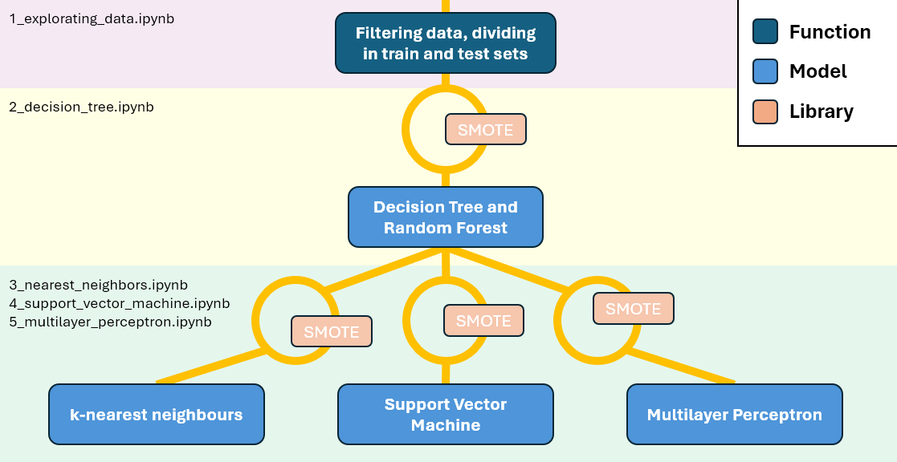

# Description:
"Images of 13,611 grains of 7 different registered dry beans were taken with a high-resolution camera. A total of 16 features; 12 dimensions and 4 shape forms, were obtained from the grains." The project goal is to design and to compare Machine Learning (ML) algorithms that classify dry beans: Decision Tree (DT), Random Forests (RF), k-Nearest Neighbours (KNN), Support Vector Machine (SVM), and Multilayer Percepton (MP; best performance). For this purpose, notebooks contain comments on the model training (imbalanced or balanced datasets), tuning (random or grid search, using different combination of features depending on their importance pointed out by RF) and performance (overall metrics, scores by classes, and confusion matrices); optimal classificators (CLF) from each ML algorithm are saved above as Pickle objects. Raw data can be retrieved [here](https://doi.org/10.24432/C50S4B).  

# Pipeline:
  

# Requirements:
```
- python 3.12.2
- pandas 2.2.0
- seaborn 0.13.2
- matplotlib 3.8.3
- ucimlrepo 0.0.6
- scikit-learn 1.4.2
- numpy 1.26.4
- scipy 1.12.0
- imblearn 0.12.3
- tqdm 4.66.2
- scikeras 0.13.0
- keras 3.3.3
- tensorflow 2.16.1
```
